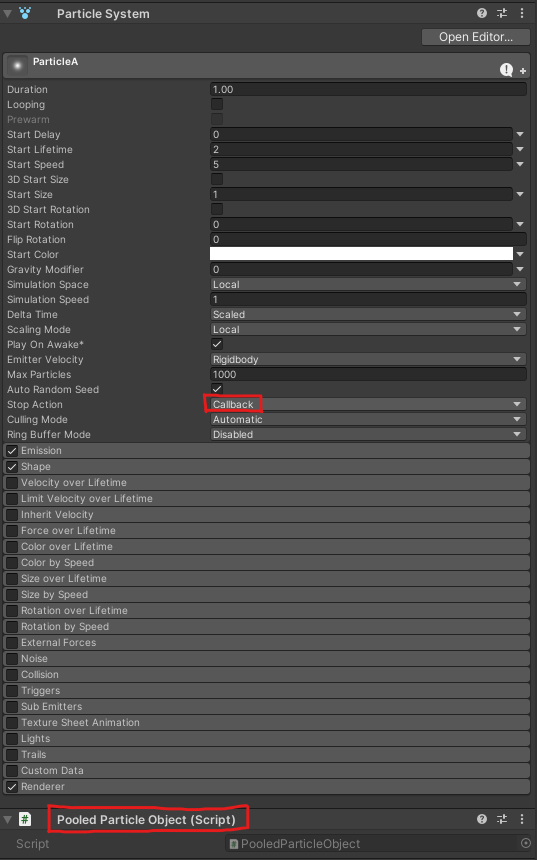

# Object Pooling SDK
Object Pooling is a great way to optimize your projects and lower the burden that is placed on the CPU when having to rapidly create and destroy GameObjects.

- Generic type objects
- Particle System

#### Table of Contents
- [Requirements](#requirements)
- [Installation](#installation)
- [Usage](#usage)

## Requirements
- Unity 2019.4 or newer

## Installation
There is only one method of installation available for the Object Pooling SDK:

[comment]: <> (<details>)
<summary><b>Unity Package Manager</b></summary>

1. From within the Unity Editor navigate to **Edit > Project Settings** and then to the **Package Manager** settings tab.

   

2. Create a *New Scoped Registry* by entering
    ```
    Name        npmjs
    URL         https://registry.npmjs.org
    Scope(s)    com.pika
    ```
   and click **Save**.
3. Open the **Window > Package Manager** and switch to **My Registries** via the **Packages:** dropdown menu. You will see the Object Pooling SDK package available
   on which you can then click **Install** for the platforms you would like to include. Dependencies will be added automatically.

   > *Depending on your project configuration and if you are upgrading from a previous version, some of these steps may already be marked as "completed"*

   

[comment]: <> (</details>)


## Usage

### Creating Instance

There is two method of creating a pool:

1. Creating directly from the ObjectPooling class:
```C#
//Create a pool from ObjectPooling.Instance with desired prefab to be pooled as parameter
var exampleObjectPool = ObjectPooling.Instance.CreatePool(exampleObjectPrefab);

//You can expand pool options with these methods
exampleObjectPool.AsParent(transform); // Default transfrom of inactive items in the pool
exampleObjectPool.WithInitialSize(10); // Initial size o the pool
```

2. Creating the instance
```C#
//Create a pool directly
var pool = new Pool<ExampleObject>(exampleObjectPrefab);
exampleObjectPool = ObjectPooling.Instance.InitializePool<Pool<ExampleObject>>(pool);
```

### Spawn Objects

```C#
// Spawn object from the pool
var clone = exampleObjectPool.Spawn();

//If you trying to access the pool from other scopes, and you have the reference of the prefab
//You can access to that pool by calling this method
var exampleObjectPool = ObjectPooling.Instance.GetPool(prefab);
//Then spawn from that pool
var clone = exampleObjectPool.Spawn();

// You can pass parameters to the Spawn method like as Unity.Object.Instantiate(...) method
// Transform as parent
// Vector3 as global position
// Quaternion as global rotation
var clone = exampleObjectPool.Spawn(parent, position, rotation);

// If you have the reference of the prefab, you can just call:
prefab.Spawn(); // This method automaticly creates the pool by itself with default options
```

### Recycle Objects

```C#
// Once you want to return the object to the pool, you need to call recycle method from the pool
exampleObject.Recycle(clone);

// If you have not reference of the pool you can just call these
// **Reminder: Calling Recycle() directly from the related pool as mentioned above is recommended in concern of performance!***
ObjectPooling.Instance.Recycle(clone);
// Or
clone.Recycle();

//All clones can be returned to the pool by this method
exampleObjectPool.RecycleAll();

//All clones can be destroyed including actives and inactives by this method
exampleObjectPool.DestroyAll();
```

#### Particle Pooling
To use particles with this system, you need to do two steps in target prefab:
1. Set "Stop Action" to "CallBack" in particle system
2. Add Component PooledParticleObject



<br>
<br>

#### Callbacks
1. <i>ICreationCallbackReceiver</i>
2. <i>ISpawnCallbackReceiver</i>
3. <i>IRecycleCallbackReceiver</i>

These interfaces help you to receive callbacks when object is created, spawned and recycled
```C#
    public class ExampleObject : MonoBehaviour, ICreationCallbackReceiver, ISpawnCallbackReceiver, IRecycleCallbackReceiver
    {
        public void OnCreated()
        {
        }
        
        public void OnSpawned()
        {
        }
        
        public void OnRecycle()
        {
        }
    }
```

## License
[Modified MIT License](LICENSE.md)